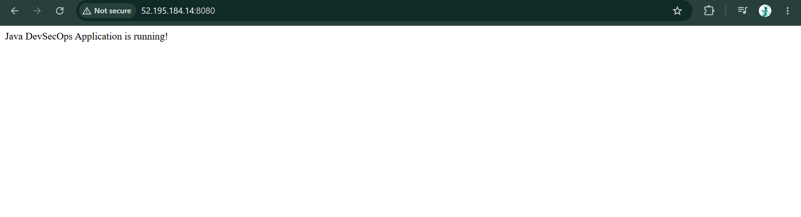
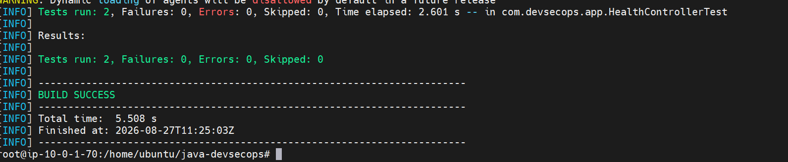
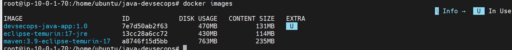
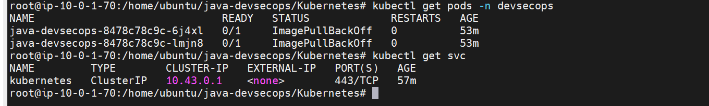
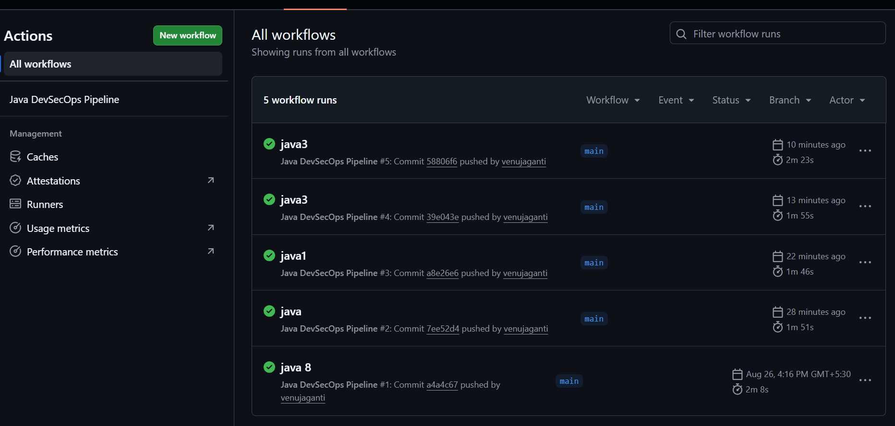
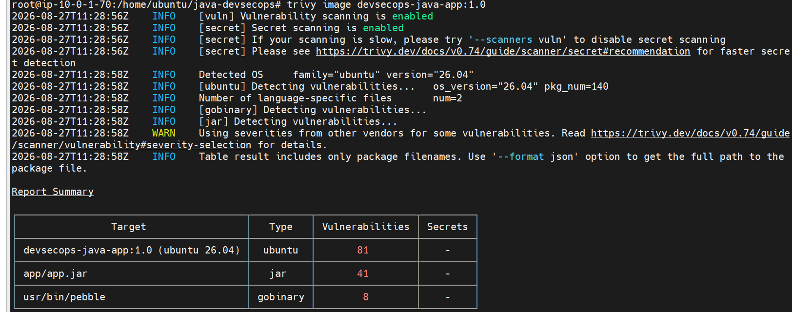

# ☕ Java DevSecOps Application

A **Java Spring Boot** application developed using **Java 17, Maven, and Spring Boot**. The application is containerized using **Docker**, deployed using **Kubernetes**, automated with **GitHub Actions CI/CD**, and secured using **Trivy vulnerability scanning**.

## 🚀 Project Overview

The Java DevSecOps application demonstrates a complete DevSecOps workflow from source code management and automated testing to Docker containerization, security scanning, and Kubernetes deployment.

The project focuses on integrating **development, security, and operations** into a single automated workflow.

## 🛠️ Technology Stack

| Category         | Technologies         |
| ---------------- | -------------------- |
| Programming      | Java 17              |
| Framework        | Spring Boot          |
| Build Tool       | Maven                |
| Version Control  | Git, GitHub          |
| CI/CD            | GitHub Actions       |
| Containerization | Docker               |
| Orchestration    | Kubernetes, Minikube |
| Security         | Trivy                |
| Operating System | Ubuntu Linux         |

## ✨ Key Features

* ☕ Java Spring Boot application
* 🧪 Automated Maven testing
* 📦 Maven application packaging
* 🐳 Docker containerization
* 🔐 Docker image vulnerability scanning with Trivy
* ☸️ Kubernetes deployment
* 🔄 GitHub Actions CI/CD
* 🐧 Linux-based deployment
* 📚 DevSecOps workflow implementation

## 🏗️ Architecture

```text
                         Developer
                             │
                             ▼
                          GitHub
                             │
                             ▼
                    GitHub Actions
                             │
                  ┌──────────┴──────────┐
                  ▼                     ▼
             Maven Build          Security Scan
                  │                    Trivy
                  ▼                     │
              Unit Tests                 │
                  │                     │
                  └──────────┬──────────┘
                             ▼
                       Docker Image
                             │
                             ▼
                        Kubernetes
                             │
                             ▼
                     Java Application
```

## 📁 Project Structure

```text
java-devsecops/
│
├── src/
│   ├── main/
│   │   ├── java/
│   │   └── resources/
│   │
│   └── test/
│
├── Kubernetes/
│   ├── namespace.yaml
│   ├── deployment.yaml
│   └── service.yaml
│
├── .github/
│   └── workflows/
│       └── ci.yml
│
├── Dockerfile
├── pom.xml
├── README.md

---

## ⚙️ Run Application

### Clone the Repository

```bash
git clone https://github.com/venujaganti/java-devsecops.git
cd java-devsecops
```

### Build the Application

```bash
mvn clean package
```

### Run Tests

```bash
mvn clean test
```

### Start the Application

```bash
mvn spring-boot:run
```

The application runs on:

```text
http://localhost:8080
```

---

## 🐳 Docker

### Build the Docker Image

```bash
docker build -t devsecops-java-app:1.0 .
```

### Check the Image

```bash
docker images
```

### Run the Container

```bash
docker run -d \
  --name devsecops-java-app \
  -p 8080:8080 \
  devsecops-java-app:1.0
```

### Check Running Containers

```bash
docker ps
```

Open the application:

```text
http://localhost:8080
```

---

## ☸️ Kubernetes Deployment

### Start Minikube

```bash
minikube start --driver=docker
```

### Deploy the Application

```bash
kubectl apply -f Kubernetes/
```

### Check Pods

```bash
kubectl get pods -A
```

### Check Services

```bash
kubectl get svc -A
```

### Check Deployments

```bash
kubectl get deployments -A
```

### Access the Application

```bash
minikube service <service-name> --url
```

---

## 🔐 Security Scan

**Trivy** is used to scan the Docker image for known vulnerabilities.

Run:

```bash
trivy image devsecops-java-app:1.0
```

Trivy provides vulnerability information based on severity:

```text
CRITICAL
HIGH
MEDIUM
LOW
UNKNOWN
```

The security scan is integrated into the CI/CD workflow so that vulnerabilities can be identified before deployment.

---

## 🔄 CI/CD Pipeline

```text
Developer
    │
    ▼
 GitHub
    │
    ▼
GitHub Actions
    │
    ▼
Maven Build
    │
    ▼
 Unit Tests
    │
    ▼
Docker Build
    │
    ▼
Trivy Security Scan
    │
    ▼
Kubernetes Deployment
    │
    ▼
Java Application
```

GitHub Actions automates the build, testing, Docker image creation, and security scanning process whenever changes are pushed to the repository.

### Workflow File

```text
.github/workflows/ci.yml
```

---

# 📸 Project Screenshots

## 🏠 1. Java Spring Boot Application



This screenshot shows the running Java Spring Boot application.

---

## 🧪 2. Maven Tests



This screenshot demonstrates the successful execution of Maven tests.

---

## 🐳 3. Docker



This screenshot shows the Docker image/container used to run the Java application.

---

## ☸️ 4. Kubernetes Deployment



This screenshot demonstrates the application running on Kubernetes/Minikube.

---

## 🔄 5. GitHub Actions CI/CD



This screenshot shows the GitHub Actions workflow executing the DevSecOps pipeline.

---

## 🔐 6. Trivy Security Scan



This screenshot demonstrates the Trivy vulnerability scan performed against the Docker image.

---

# 🎯 Project Objective

The objective of this project is to demonstrate practical knowledge of:

* Java application development
* Spring Boot
* Maven
* Docker
* Kubernetes
* Minikube
* Git and GitHub
* GitHub Actions
* Trivy security scanning
* Linux administration
* DevSecOps practices

The project demonstrates how security can be integrated into the software delivery pipeline instead of being performed only after deployment.

---

# 🔒 DevSecOps Workflow

```text
        DEVELOPMENT
             │
             ▼
          GitHub
             │
             ▼
          BUILD
             │
          Maven
             │
             ▼
          TESTING
             │
             ▼
       Docker Build
             │
             ▼
      SECURITY SCAN
          Trivy
             │
             ▼
       DEPLOYMENT
        Kubernetes
             │
             ▼
       APPLICATION
```

---

# 👨‍💻 Author

**Venu Jaganti**

B.Tech – Computer Science & Engineering

GitHub: [Venu Jaganti](https://github.com/venujaganti)

---

# 📄 License

This project is created for **educational and portfolio purposes**.
